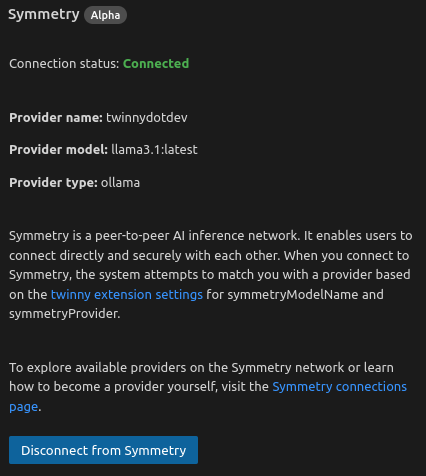

Symmetry is an experimental decentralized computing network that allows users to share and access computational resources. Initially integrated with the twinny VSCode extension, Symmetry has potential to become a powerful tool for developers, researchers, and data scientists.

Note: Symmetry is still in alpha and there may be some issues. Please report any issues you find at [https://github.com/twinnydotdev/symmetry](https://github.com/twinnydotdev/symmetry).


The symmetry client is licensed under the MIT license.

[https://github.com/twinnydotdev/symmetry](https://github.com/twinnydotdev/symmetry)


## Connecting to Symmetry in twinny VSCode Extension

Symmetry can be used as an inference provider within the twinny VSCode extension if there are active providers available in the network for the specific model.  You can find the current providers and the available models at: [https://twinny.dev/symmetry](https://twinny.dev/symmetry).

1. In the twinny extension settings, select your desired model.
2. Click the "Connect to Symmetry" button in the extension.
3. The extension will automatically connect to the Symmetry network using the selected model. The model name can be configured inside the twinny extension settings, please try to match this with one of the available models found at [https://twinny.dev/symmetry](https://twinny.dev/symmetry). This process will be improved in the future to allow users to select from a list of available models.
4. When you're connected you should see the green "Connected" status in the extension sidebar.
5. Try sending some requests to the model using the twinny extension it should work as expected.

#### Disconnected:


#### Connected:


Look for the icon:


## Becoming a Symmetry Provider

As Symmetry grows, there's an opportunity for users to contribute by becoming providers. Here's what you need to know:

### Why Consider Becoming a Provider?

- Contribute to a decentralized computing network
- Utilize idle computational resources
- Potential for future incentive systems (subject to network development)
- Gain experience with decentralized technologies
- Become the collector of data for machine learning research 

### How to Become a Provider

1. **Install Symmetry**:

   Unix
   ```bash
   curl -fsSL https://raw.githubusercontent.com/twinnydotdev/symmetry/main/install.sh | sh
   ```

   Windows
   ```
   iwr -useb https://raw.githubusercontent.com/twinnydotdev/symmetry/main/install.ps1 | iex
   ```

2. **Configure Your Node**:
   Create a `provider.yaml` file in `~/.config/symmetry/` with your provider settings.

3. **Start Your Node**:
   ```bash
   symmetry-cli
   ```

### Provider Configuration

Example `provider.yaml`:

```yaml
apiHostname: localhost # The host of your inference server
apiKey: # The API key for your inference server
apiPath: /v1/chat/completions # The path to the inference endpoint
apiPort: 11434 # The port of your inference server
apiProtocol: http # The protocol of your inference server
apiProvider: ollama # The name of the inference provider
dataCollectionEnabled: true # Whether to advertise that data collection is enabled
maxConnections: 10 # The maximum number of connections to allow
modelName: llama3:8b # The name of the model you are serving
name: provider  # The name of your provider
path: /home/richard/.config/symmetry/default # The data directory
public: true # Whether your provider is publicly accessible
serverKey: 4b4a9cc325d134dee6679e9407420023531fd7e96c563f6c5d00fd5549b77435 # The symmetry server key which handles provider messages
systemMessage: "Im a system message" # Optional system message for all chats
```

Adjust these settings based on your setup and preferences.

## Considerations for Providers

- Ensure your node is secure and up-to-date
- Be aware of the data passing through your node
- Maintain a stable and reliable connection

## Beyond VSCode: Future Developments

While currently focused on the twinny extension, Symmetry's potential extends further:

- **Standalone Usage**: Plans are in place to develop a Node.js package that will allow developers to tap into the Symmetry network from any Node.js application.
- **API Access**: Future versions may include direct API access, enabling integration with a wide range of applications and services.

## Frequently Asked Questions (FAQs)

1. **Q: Is Symmetry only for VSCode users?**
   A: While currently integrated with the twinny VSCode extension, there are plans to expand Symmetry's accessibility through a Node.js package and potentially direct API access in the future.

2. **Q: Can I use Symmetry for chat and autocomplete?**
   Currently, Symmetry is designed for chat, but it could be used for other purposes in the future (e.g., autocomplete).

3. **Q: How does Symmetry ensure data privacy?**
   A: Symmetry uses encrypted connections for all communications. After initial matchmaking, clients and providers communicate directly, bypassing the central server. However, providers do have access to decrypted data for processing, so consider data sensitivity when using the network.

4. **Q: Can I use Symmetry in my own projects?**
   A: Currently, Symmetry is primarily used within the twinny VSCode extension. However, plans for a Node.js package are in development, which will allow broader integration in various projects.

5. **Q: Are there rewards for being a provider?**
   A: At present, there isn't a formal reward system. However, as the network evolves, incentive structures may be implemented. Contributing as a provider is currently an opportunity to support the network and gain experience with decentralized technologies.

6. **Q: How can I stay updated on Symmetry's development?**
   A: Keep an eye on the official Symmetry GitHub repository and documentation for the latest updates and announcements.

By exploring Symmetry, whether as a user through the twinny extension or as a provider, you're participating in the development of decentralized computing technologies. As Symmetry evolves, it aims to offer more flexible and powerful options for developers and researchers alike.